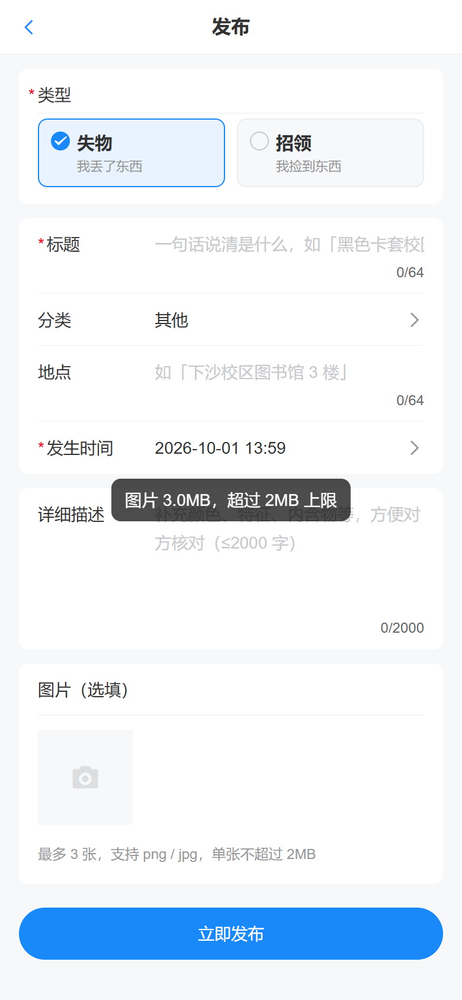
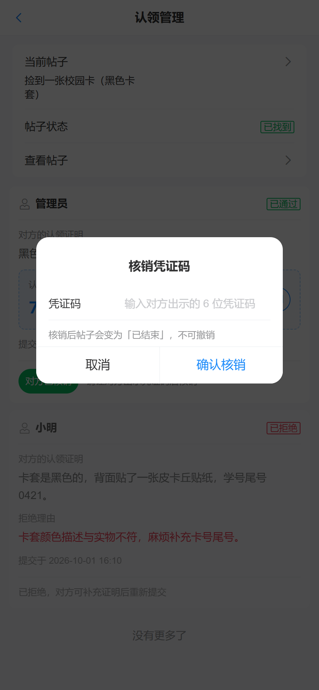
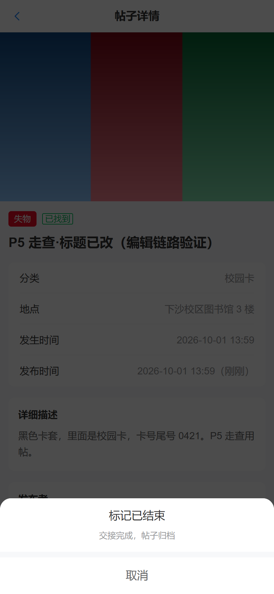

# 校园失物招领系统

> 2026 杭电助手技术部招新任务 · 提交目录 `kanzakierisa`

一个校园失物招领平台：支持发布失物 / 招领信息、搜索浏览、状态流转，并通过「认领申请 → 帖主审核 → 电子凭证核销」完成点对点交接，另附规则化的智能匹配推荐。

---

## 目录

- [功能总览](#功能总览)
- [现场演示](#现场演示)
- [项目截图](#项目截图)
- [快速开始](#快速开始)
- [测试账号](#测试账号)
- [目录结构](#目录结构)
- [技术栈](#技术栈)
- [文档](#文档)
- [设计思考](#设计思考)

---

## 功能总览

| 模块   | 能力                                                           |
| ---- | ------------------------------------------------------------ |
| 账号   | 注册 / 登录（JWT HS256）/ 查改个人资料（昵称、联系方式、是否公开）                     |
| 帖子   | 发布、编辑、删除；列表按类型 / 状态 / 分类 / 关键字组合筛选 + 分页；详情页图片轮播              |
| 图片   | 最多 3 张，png/jpeg、≤2MB，服务端三重校验（体积 + 扩展名 + 文件头魔数）                |
| 状态机  | `open → matched → closed`（另有 `open → closed` 直通），非法流转返回 1007 |
| 联系方式 | 三级可见性：本人 / 作者主动公开 / **双方存在已通过或已核销的认领**；判定在 SQL 层完成           |
| 认领   | 提交认领证明（10–500 字）→ 帖主通过 / 拒绝（可填理由）→ 6 位电子凭证码 → 帖主核销 → 帖子自动结束  |
| 认领约束 | 一张帖最多一条已通过认领、一人一张帖只能申请一次，由 MySQL 唯一索引保证（并发下也不破）              |
| 智能匹配 | 中文 2-gram + 规则打分（分类 40 / 地点 30 / 时间 20 / 标题 10，阈值 60，最多 5 条） |
| 彩蛋   | 交接完成后，帖主可领取一张 `<canvas>` 绘制的「拾金不昧荣誉证书」并下载为 PNG               |

关于「方向」，两件事需要分开说，因为它们并不对称：

| 能力   | 方向  | 说明                                                             |
| ---- | --- | -------------------------------------------------------------- |
| 认领   | 单向  | **只有 `found`（招领）帖可以被认领**：捡到东西的人发帖，失主来认领。`lost`（失物）帖不提供认领入口 |
| 智能匹配 | 双向  | 候选集取**类型补集**：`lost` 帖推荐 `found` 帖，`found` 帖同样推荐 `lost` 帖，互为候选   |

一键走完认领链路的实测截图见 `docs/screenshots/p6/`（33 张，帖主 / 申请人 / 游客三种视角）。

---

## 现场演示

演示方式是**面试现场直接把项目跑起来，用浏览器走一遍完整业务流程**，不依赖 Apifox / Postman 之类的接口工具，也不需要录屏。

起服务只需一条命令（细节见「[快速开始](#快速开始)」）：

```bash
dev.bat          # Windows：双击，或在终端执行
bash dev.sh      # macOS / Linux / Git Bash
# → 前端 http://localhost:5173    后端 http://localhost:8080
```

然后按下面这个顺序走一遍，即可覆盖全部核心能力：

| #  | 操作                                          | 说明要点                                                                |
| -- | ------------------------------------------- | ------------------------------------------------------------------- |
| 1  | 游客打开首页 `/`                                  | 列表对游客开放；顶部 Tab 切「失物 / 招领」，按分类 / 状态 / 关键字组合筛选并翻页                     |
| 2  | 点进任意「招领」帖 `/posts/:id`                      | 游客看不到联系方式，底部操作栏是「登录后联系」                                             |
| 3  | 用 `alice` 登录 `/login` → 发布 `/publish`       | 选「我捡到东西」发一条招领帖，可传最多 3 张图；上传三重校验，改名的文本文件会被拦下（1009）                   |
| 4  | 换成 `bob` 登录，打开刚发的那条帖                        | 操作栏出现「这是我的」→ 填写只有物主才知道的特征（10–500 字）提交认领                              |
| 5  | 换回 `alice`，进「认领管理」`/claims/manage`          | 看到待审核申请与申请人写下的特征证明，点「通过」                                            |
| 6  | `bob` 进「我的认领」`/me/claims`                    | 拿到 6 位电子凭证码；回到帖子详情，联系方式已解锁（双方存在已通过的认领）                              |
| 7  | `alice` 在认领管理里核销                             | 输入凭证码 → 核销成功，帖子**在同一事务内**自动流转为「已结束」                                  |
| 8  | `alice` 领取证书                                 | 交接完成后可领取 `<canvas>` 绘制的「拾金不昧荣誉证书」并下载为 PNG                            |
| 9  | 回首页看详情页底部的「可能有这些匹配」                         | 列出类型互补的候选帖（`lost` ↔ `found`），每条都带 `分类相同 +40` 这类可解释的打分理由            |
| 10 | 「我的」页改昵称 `/me`                              | 改完回首页，列表卡片上的作者昵称同步变化（个人资料与帖子是联表查询，不存在两处不同步）                         |

> **演示前记得**：先导入 `server/sql/seed.sql`（3 个账号 + 16 条帖子 + 2 条认领），否则认领链路没有可操作的对象。`dev.bat` / `dev.sh` 会自动完成这一步。
>
> 需要核对某个接口的请求体或错误码时，用浏览器 F12 的 Network 面板即可；完整的接口契约另见 [`docs/api.md`](docs/api.md)（20 个接口的鉴权方式、请求示例、响应示例与错误表）。

---

## 项目截图

### 首页与浏览

| 游客均可浏览 | 关键字搜索 | 详情页（游客看不到联系方式） |
| ---- | ----- | ------------ |
|  |  |  |

### 发布与编辑

| 发布表单 | 上传校验 | 发布成功 |
| ---- | ---- | ---- |
|  |  |  |

### 认领链路（帖主 / 申请人双视角）

| 提交认领证明 | 帖主审核台 | 生成凭证码 |
| ------ | ----- | ----- |
|  |  |  |

| 联系方式解锁 | 核销凭证 | 拾金不昧证书 |
| ------ | ---- | ------ |
|  |  |  |

### 智能匹配与状态流转

| 匹配推荐 | 状态流转弹层 | 个人中心 |
| ---- | ------ | ---- |
|  |  |  |

> 完整走查截图：`docs/screenshots/p5/`（56 张）、`docs/screenshots/p6/`（33 张）。

---

## 快速开始

### 0. 一键启动（推荐）

不想手动开三个终端的话，根目录提供了启动脚本，会自动完成  
「检查环境 → 建库导数据 → 起后端 → 起前端 → 打开浏览器」：

```bash
# Windows：双击 dev.bat，或在终端执行
dev.bat

# macOS / Linux / Git Bash
bash dev.sh
```

脚本是幂等的：已存在的 `.env`、已经跑着的服务、已装好的 `node_modules`  
都会自动跳过，重复执行不会出问题。首次运行时会自动生成一个随机 `JWT_SECRET`  
写进 `server/.env` —— 后端会拒绝用 `.env.example` 里的占位密钥启动，不生成的话  
一键启动会在后端这一步失败。

前置条件：已安装 **Go**、**Node.js**，以及 **Docker**（或本机 MySQL 8）。  
脚本会先检查这三个，缺哪个会明确告诉你。

> 手动启动的完整步骤见下面 1~3 节。

### 1. 数据库

```bash
cd server
# 方式 A：Docker（推荐）
docker compose up -d
docker compose exec -T mysql mysql -uroot -p$DB_PASSWORD --default-character-set=utf8mb4 < sql/schema.sql

# 方式 B：本机 MySQL 8
mysql --default-character-set=utf8mb4 -uroot -p < sql/schema.sql
```

> ⚠️ `server/.env` 的 `DB_PASSWORD` 必须与 `server/docker-compose.yml`  
> 里的 `MYSQL_ROOT_PASSWORD` 一致。用 Docker 时 `docker-compose.yml`  
> 已通过 `env_file: .env` 自动读取，无需手动同步。

### 1.5 演示数据

```bash
cd server
# 3 个账号（alice / bob / carol，密码统一 123456）+ 16 条帖子 + 2 条认领记录
# Windows 下必须显式指定字符集，否则中文昵称会按 GBK 解码报错
mysql --default-character-set=utf8mb4 -uroot -p < sql/seed.sql

# 或直接：
make seed
```

### 2. 后端

```bash
cd server
cp .env.example .env      # 按实际情况修改 DB_PASSWORD / JWT_SECRET
go mod tidy
go run ./cmd/api
# → http://localhost:8080/api/health
```

> `JWT_SECRET` **必须改掉**：它还是 `.env.example` 里的占位值时，服务会直接拒绝启动  
> （避免用一个人人皆知的弱密钥签发 token）。

### 3. 前端

```bash
cd web
npm install
npm run dev
# → http://localhost:5173
```

---

## 测试账号

seed 数据内置 3 个账号，密码统一为 `123456`：

| 用户名     | 昵称  | 角色      | 联系方式                    | 说明                    |
| ------- | --- | ------- | ----------------------- | --------------------- |
| `alice` | 小明  | `user`  | `wx: alice_hdu`（**公开**） | 演示「作者主动公开联系方式」        |
| `bob`   | 小红  | `user`  | `qq: 12345678`（默认不公开）   | 演示「需认领通过后可见」          |
| `carol` | 管理员 | `admin` | `tel: 13800000000`      | 演示「admin 也读不到别人的认领列表」 |

> **`carol` 虽然是 admin，但 `GET /api/posts/:id/claims` 依然会返回 1003**  
> —— 这是刻意的设计：审核允许 admin（处置事故），读取不允许（窥探纠纷细节）。

---

## 目录结构

```
kanzakierisa/
├── README.md                     本文件
├── dev.sh · dev.bat              一键启动脚本
├── docs/
│   ├── api.md                    20 个接口的完整契约
│   ├── code-guide.md             技术说明（概览/目录/数据库/关键实现/安全/限制）
│   ├── wireframe/                页面线框
│   └── screenshots/
│       ├── p5/                   发布编辑与个人中心走查（56 张）
│       └── p6/                   认领链路走查（33 张）
├── server/                       后端（Go 1.22+ / Gin / MySQL）
│   ├── cmd/api/main.go           入口
│   ├── internal/
│   │   ├── config/               配置加载与 DSN
│   │   ├── db/                   连接池
│   │   ├── router/               路由注册与依赖装配
│   │   ├── middleware/           RequestID / Recover / CORS / Auth / OptionalAuth
│   │   ├── handler/              HTTP 编解码层（零 SQL）
│   │   ├── service/              业务规则层
│   │   ├── store/                手写参数化 SQL 层（零 HTTP）
│   │   ├── model/                实体与 DTO
│   │   └── pkg/                  无状态工具包（apperr/jwtutil/voucher/similar/...）
│   ├── sql/
│   │   ├── schema.sql            建表（含 approved_flag 生成列）
│   │   └── seed.sql              演示数据
│   ├── Makefile
│   ├── docker-compose.yml
│   └── .env.example
└── web/                          前端（Vue 3 / Vite / Vant）
    └── src/
        ├── api/                  6 个接口封装模块
        ├── components/           8 个可复用组件
        ├── pages/                8 个页面
        ├── router/               路由 + 登录守卫
        ├── store/                Pinia 用户状态
        ├── constants/            枚举与常量
        ├── utils/                时间与文案格式化
        └── styles/               全局样式
```

完整的逐目录说明见 [`docs/code-guide.md` 第二章](docs/code-guide.md)。

---

## 技术栈

| 层  | 选型                                                                    |
| -- | --------------------------------------------------------------------- |
| 后端 | Go 1.22+（实测 1.27.1）· Gin · database/sql + sqlx（**手写参数化 SQL，不用 ORM**）    |
| 数据库 | MySQL 8.0（实测 8.0.46）                                                  |
| 认证 | JWT（HS256）· bcrypt（cost=10）                                          |
| 前端 | Vue 3（`<script setup>`）· Vite · Vant 4 · Pinia · Vue Router · Axios  |

---

## 文档

| 文件                                            | 内容                                                          |
| --------------------------------------------- | ----------------------------------------------------------- |
| [`docs/api.md`](docs/api.md)                  | 20 个接口的完整契约：鉴权 / 请求体 / 请求示例 / 响应示例 / 错误表，以及跨接口的可见性、软鉴权、分页约定 |
| [`docs/code-guide.md`](docs/code-guide.md)    | 项目概览与请求流转、目录说明、数据库设计、关键实现（按 SPEC 7.1–7.7 逐节）、安全措施清单、已知限制    |
| [`docs/wireframe/`](docs/wireframe)           | 页面线框                                                        |
| `docs/screenshots/p5/`、`docs/screenshots/p6/` | 浏览器走查截图（发布编辑 56 张、认领链路 33 张）                                |

---

## 设计思考

### 一、整体思路

这个系统的**核心难点不在 CRUD**，而在「认领」这一条链路上：

```
多个人可能认领同一样东西  →  并发下的业务不变量如何保证？
认领通过后联系方式要解锁  →  隐私数据如何只在该给的时候给？
帖子状态会被两条路径改动  →  规则如何只维护一份？
凭证码要被人念、被人抄    →  错误率如何降下来？
```

我给自己定的原则是：**能用数据库约束表达的规则，就不写在应用层。**

具体展开三处：

### 二、三处我认为最有价值的设计

#### 1. 「一张帖最多一条已通过认领」交给 MySQL 生成列 + 唯一索引

直觉写法是「先查有没有 `approved`，没有就插入」。这在并发下必然失效 ——  
两个请求同时查到「没有」，然后双双插入。而认领恰恰是「几个同学同时抢一样东西」  
的场景，天然高并发。

MySQL 8 没有「部分索引」，但可以用**生成列**绕出来：

```sql
approved_flag TINYINT GENERATED ALWAYS AS (
  IF(status IN ('approved','redeemed'), 1, NULL)
) STORED,
UNIQUE KEY uk_post_approved (post_id, approved_flag)
```

利用的就是「**MySQL 唯一索引允许任意多个 NULL**」这个特性：  
`pending` / `rejected` 的 `approved_flag` 是 `NULL`，可以任意多条共存；  
而 `approved` / `redeemed` 是 `1`，同一帖只能有一条。

两个细节值得一提：`redeemed` 也计入 `1`（否则核销后腾出空位，别人还能再通过一条）；  
用 `STORED` 而非 `VIRTUAL`，因为可以直接 `SELECT approved_flag` 肉眼验证规则。

**收益**：这条约束连「有人绕过应用层直接写库」都挡得住。业务不变量变成了数据库事实。

#### 2. 联系方式可见性下推到 SQL，而不是「查出来再删」

SPEC 明确要求在 SQL 层决定是否 SELECT `contact`。我按这个做了，并且发现它的好处比想象中大。  
`post_store.go` 的 `contactCaseSQL` 就是这段判定，与 `model.contactVisible` 逐条对应：

```sql
CASE
  WHEN u.id = ? THEN u.contact                        -- 本人
  WHEN u.contact_public = 1 AND ? > 0 THEN u.contact  -- 作者主动公开（且请求者已登录）
  WHEN EXISTS (SELECT 1 FROM claims c                 -- 双方存在已通过的认领关系
               WHERE c.post_id = p.id AND c.claimant_id = ?
                 AND c.status IN ('approved','redeemed'))
                                THEN u.contact
  ELSE ''
END AS author_contact
```

两个收益：

1. **隐私数据不进内存**：不可见时数据库直接返回空串。而「查出来再删」的数据  
   已经进过 Go 的内存 —— 可能进日志、可能进 panic 栈、可能被将来的某次重构漏删。
2. **不可能自相矛盾**：`contact` 和 `contact_visible` 出自**同一条 SQL 语句**，  
   所以永远不会出现「标志说可见、值却是空字符串」这种响应。

列表接口更进一步，干脆不 SELECT 这一列 —— 列表页从不展示联系方式，  
多查一列只是白白把全站用户的联系方式搬进内存。

两个容易踩的细节：`? > 0` 不能省（`contact_public` 表达的是「对所有**登录用户**公开」，  
游客不在其列）；游客请求时第三个分支**根本不拼进 SQL**，因为条件恒假，  
带上它只会让数据库白做一次相关子查询。

#### 3. 状态机白名单只定义一次，并导出给认领流程复用

帖子状态会被两条路径改动：作者手动点按钮、认领审核时自动联动。  
我在 P3 就把白名单函数 `ValidateTransition` **首字母大写导出**，  
到 P6 认领流程直接复用。

如果 P6 图省事在 `claim_service` 里再写一份规则表，两份定义迟早分叉 ——  
那正是状态机最典型的失效方式：**手动流转拦得住的非法跳转，自动流转却放过去了**。

更进一步：认领通过时的帖子状态更新，我给它加了一个 `tx` 参数  
（原设计里没有），让认领写入和帖子状态更新在**同一个事务**里。  
否则会出现真实的一致性洞：认领已 `approved`、帖子还停在 `open`，  
用户看到「已通过但还在寻找中」。

### 三、借鉴点

| 借鉴来源        | 借了什么       | 怎么用的                                          |
| ----------- | ---------- | --------------------------------------------- |
| 部分的索引思想     | 「部分唯一约束」   | MySQL 8 没有部分索引，用**生成列 + 唯一索引**实现等价效果（见上）      |
| 数据库约束优于应用检查 | 让 DB 做最终裁决 | 重名、重复认领、多认领通过，全部靠唯一索引 + errno 1062，不用「先查再插」   |
| 白名单优于黑名单    | 枚举校验       | 类型 / 状态 / 分类全部白名单；状态流转也是白名单 map，而非 if-else 排除 |
| 纵深防御        | 不靠单一防线     | 上传三重校验（体积 + 扩展名 + 魔数）；密码「统一文案 + 时序拉平」双防护      |
| 恒定时间比较      | 防时序侧信道     | 凭证码用 `subtle.ConstantTimeCompare`，且先比长度再比内容   |

### 四、我踩过并记录下来的坑

只列三个最有代表性的，完整的在 `docs/code-guide.md`：

#### 1. 时间「差 8 小时」的经典 bug

`schema.sql` 里 `DEFAULT CURRENT_TIMESTAMP` 按**会话时区**求值，  
而 Go 的 DSN 用 `loc=UTC` 解析 —— 一进一出凭空差 8 小时。

我的解法是「**时间只从一处产生**」：库里存 UTC（导入前先 `SET time_zone='+00:00'`）、  
DSN 固定 `loc=UTC`、`updated_at` 由 Go 侧算好传进去（不用 SQL 的 `NOW()`）、  
输出层手动 `Format(time.RFC3339)`，不依赖 json 包的默认序列化。

#### 2. CORS 拦掉「同源的写请求」——一个看起来像断网的 bug

原本 CORS 白名单只有 `localhost:5173`。表现极其反直觉：  
手机连同一 Wi-Fi 打开 `http://<电脑IP>:5173`，**列表能加载，一登录就失败**。

原因在 Fetch 规范：**浏览器对同源的非 GET 请求同样会带 `Origin` 头**（GET 不带）。  
前端是经 Vite proxy 转发 `/api` 的，所以从浏览器看是同源请求，  
从服务端看却是一个带 `Origin` 的跨域 POST。

**复盘**：这个缺陷能藏到后期才暴露，是因为之前的验收全在 `localhost:5173`  
这一个 Origin 上做的。**验收环境的多样性本身就是用例** ——  
只在一个「恰好落在白名单里」的地址上跑，等于把这条规则测没了。

修法是改用 `AllowOriginFunc` 按来源判定（回环 + 私有网段，端口不限），  
而不是维护固定白名单。

#### 3. `COUNT(*)` 与 `SELECT` 必须复用同一个 WHERE 构造器

如果 `total` 和 `list` 各拼一套筛选条件，就会出现「翻到第 3 页突然空了、  
但 `total` 还显示有 200 条」。这是列表接口最经典、也最难通过单个接口测试  
发现的 bug —— 因为第 1 页看起来完全正常。

我把条件构造收成一个纯函数 `buildPostWhere`，`List` 和 `Count` 共用，  
这类不一致在结构上就不可能发生。

### 五、如果继续做，我会改进什么

| 优先级 | 项        | 思路                                               |
| --- | -------- | ------------------------------------------------ |
| 高   | 图片孤儿文件回收 | 定期扫描 `uploads/`，清掉超过 N 小时未被 `posts.images` 引用的文件 |
| 高   | 自动化测试    | 先补 `pkg/*` 纯函数单测，再补 service 层的状态机与认领校验顺序         |
| 中   | 登录限流     | 网关层按 IP + 用户名做滑动窗口，失败达阈值后指数退避                    |
| 中   | 深分页优化    | 改游标分页（`WHERE (created_at, id) < (?, ?)`），复用现有排序键 |
| 低   | 匹配语义化    | 引入句向量模型做语义召回，现有 `reasons` 机制直接保留作精排              |
| 低   | 服务端登出黑名单 | 用 Redis 存 jti 并设 TTL，或改短期 access + refresh token |

### 六、我对自己这份实现的判断

**做得比较满意的**：认领链路的并发安全（四层防护叠加）、  
联系方式可见性的 SQL 下推、错误码语义的一致性（13 个码各有明确边界与固定校验顺序）。

**明确知道不足的**：没有自动化测试；匹配是字面相似度而非语义；  
图片只增不删；分页是 offset 方案；没有做校园统一身份认证对接、线上支付、  
站内私信、对象存储，也没有服务端 token 黑名单（登出仅前端清 token）——  
这些都在任务范围之外，列在这里是为了说明「边界在哪里」而不是「忘了做」。

**一条贯穿始终的方法**：把「规则」和「执行点」分离 ——  
规则只定义一次（状态机白名单、枚举白名单、可见性 CASE），  
所有需要它的地方都复用同一份。这样即使将来加功能，也不会出现  
「这个入口拦得住、那个入口放过去了」的不一致。
