# 校园失物招领系统

> 2026 杭电助手技术部招新任务 · 提交目录 `kanzakierisa`

一个校园失物招领平台：支持发布失物 / 招领信息、搜索浏览、状态流转，并通过「认领申请 → 帖主审核 → 电子凭证核销」完成点对点交接，另附规则化的智能匹配推荐。

---

## 目录

- [功能总览](#功能总览)
- [演示视频](#演示视频)
- [项目截图](#项目截图)
- [快速开始](#快速开始)
- [测试账号](#测试账号)
- [目录结构](#目录结构)
- [技术栈](#技术栈)
- [文档](#文档)
- [设计思考](#设计思考)
- [明确不做](#明确不做)

---

## 功能总览

| 模块 | 能力 |
| --- | --- |
| 账号 | 注册 / 登录（JWT HS256）/ 查改个人资料（昵称、联系方式、是否公开） |
| 帖子 | 发布、编辑、删除；列表按类型 / 状态 / 分类 / 关键字组合筛选 + 分页；详情页图片轮播 |
| 图片 | 最多 3 张，png/jpeg，≤2MB，服务端二次校验（扩展名 + MIME + 体积） |
| 状态机 | `open → matched → closed`（另有 `open → closed` 直通），非法流转返回 1007 |
| 联系方式 | 三级可见性：本人 / 作者主动公开 / **双方存在已通过或已核销的认领**；判定在 SQL 层完成 |
| 认领 | 提交认领证明（10–500 字）→ 帖主通过 / 拒绝（可填理由）→ 6 位电子凭证码 → 帖主核销 → 帖子自动结束 |
| 认领约束 | 一张帖最多一条已通过认领、一人一张帖只能申请一次，由 MySQL 唯一索引保证（并发下也不破） |
| 智能匹配 | 中文 2-gram + 规则打分（分类 40 / 地点 30 / 时间 20 / 标题 10，阈值 60，最多 5 条） |
| 彩蛋 | 交接完成后，帖主可领取一张 `<canvas>` 绘制的「拾金不昧荣誉证书」并下载为 PNG |

一键走完认领链路的实测截图见 `docs/screenshots/p6/`（30 张，帖主 / 申请人 / 游客三种视角）。

---

## 演示视频

**视频链接：** `待补充 —— 请在此处填入演示视频链接（B 站 / 阿里云盘 / 腾讯微云等，需设置为"任何人可访问"）`

> ⚠️ 录制前请确保后端已启动（`cd server && go run ./cmd/api`）、
> 前端已启动（`cd web && npm run dev`）、数据库已导入 `schema.sql` + `seed.sql`。

### 8 段式解说词脚本

按此脚本录制一份约 4–6 分钟的演示视频。每段给出**操作步骤**与**口播文案**，
录制时按顺序执行即可覆盖全部核心功能。

---

#### 第 1 段 · 开场与游客浏览（约 40 秒）

**操作**

1. 打开 `http://localhost:5173`（未登录状态）
2. 停留在首页列表，上下滚动展示卡片
3. 在搜索框输入「校园卡」，展示筛选结果
4. 点开任意一张 `found` 帖的详情页

**口播**

> 这是一个校园失物招领系统，前端 Vue 3 + Vant 4，后端 Go + MySQL，全部手写参数化 SQL。
>
> 现在我是未登录的游客，可以看到首页列表。我搜一下「校园卡」，列表会同时匹配标题和描述。
>
> 点进详情页 —— 注意这里：**游客看不到发布者的联系方式**，只显示「登录后可见」。
> 这个可见性判断不是在代码里查出来再删掉的，而是直接写在 SQL 的 SELECT 里，
> 不可见的联系方式根本不会进入应用内存。

---

#### 第 2 段 · 注册与登录（约 35 秒）

**操作**

1. 点击「登录 / 注册」→ 切到注册页，填一个不存在的用户名，演示重名报错（可跳过）
2. 用 `alice` / `123456` 登录
3. 登录后回到首页，展示右上角昵称

**口播**

> 我用预先准备好的账号登录：用户名 alice，密码 123456。
>
> 登录用的是 JWT，算法固定 HS256 —— 服务端会显式校验算法白名单，防止有人把头部
> 改成 `alg: none` 绕过验签。密码用的是 bcrypt，cost 是 10。
>
> 顺带说一个细节：登录失败时，「用户名不存在」和「密码错误」返回的是**完全一样的响应**，
> 而且用户名不存在时服务端**仍然会跑一次 bcrypt** —— 否则跳过哈希计算会明显更快，
> 攻击者光凭响应时间就能枚举出哪些用户名真实存在。

---

#### 第 3 段 · 发布帖子与图片上传（约 60 秒）

**操作**

1. 点「发布」→ 选择「我捡到东西」（`found`）
2. 填标题、地点，选分类
3. 上传 1 张图片，展示缩略图
4. 演示选择超过 2MB 的图片被拦下（1009）
5. 提交 → 跳转到详情页，展示图片轮播

**口播**

> 我来发布一条招领信息。类型选「我捡到东西」，填上标题和地点。
>
> 上传图片 —— 服务端做了三重校验：体积、扩展名、**还有文件头魔数**。
> 也就是说，把一个改名为 `.png` 的文本文件传上来，会被魔数直接拦下，返回 1009。
>
> 落盘的文件名是 UUID，不使用原始文件名，并且做了路径穿越防护。
>
> 提交后跳到详情页，图片正常展示。

---

#### 第 4 段 · 状态机（约 40 秒）

**操作**

1. 在刚发布的帖子上点「改状态」→ 选「标记已找到」（`open → matched`）
2. 再点「改状态」→ 选「标记已结束」（`matched → closed`）
3. 再次尝试改状态，展示弹层显示「该帖子已结束」且不可操作

**口播**

> 帖子有 `open → matched → closed` 的状态机。
>
> 这个白名单**只定义了一次**，而且导出给了认领流程复用 —— 因为认领审核通过时，
> 帖子要自动从 `open` 变成 `matched`。如果两处各写一套规则，迟早会分叉，
> 那就意味着「手动改状态拦得住的非法跳转，自动流转却放过去了」。
>
> `closed` 是终态，不可逆。而且更新语句带了 `AND status = ?` 的乐观锁，
> 两个并发请求同时改状态时，后到的那个会更新 0 行并返回错误，不会静默覆盖。

---

#### 第 5 段 · 认领申请（切换到申请人视角）（约 60 秒）

**操作**

1. 退出登录，用 `bob` / `123456` 登录
2. 找到 alice 发的那张 `found` 帖（或任意 `found` 帖）
3. 点「认领」→ 弹出输入框，先输入 5 个字（少于 10 字）展示校验失败
4. 输入完整的物品特征描述（≥10 字）→ 提交成功
5. 进入「我的认领」，展示 `pending` 状态
6. 再次尝试对同一张帖提交认领 → 展示 1008「你已提交过该帖子的认领申请」

**口播**

> 换个账号 bob，模拟「丢东西的同学」来认领。
>
> 认领需要提供物品特征证明，至少 10 个字 —— 只有 5 个字会被拦下。
>
> 提交成功后，「我的认领」里能看到这条 `pending` 的记录。
>
> 我再提交一次 —— 返回 1008。这个约束不只是应用层查一遍，
> 数据库上有 `UNIQUE(post_id, claimant_id)` 唯一索引兜底，并发下也破不了。

---

#### 第 6 段 · 帖主审核与凭证码（切换到帖主视角）（约 70 秒）

**操作**

1. 退出登录，用 `alice` / `123456` 登录（帖主）
2. 进入「认领管理」，选择自己那张帖，看到 bob 的申请
3. 先点「拒绝」，填一段理由 → 执行，展示拒绝成功
4. （另找一张帖）对另一条申请点「通过」→ 展示生成了 6 位凭证码
5. 切回 bob 账号，展示「我的认领」里凭证码已可见，**且联系方式已解锁**

**口播**

> 切回帖主 alice，进「认领管理」。
>
> 先演示拒绝 —— 可以填写理由，理由是会给到申请人的。
>
> 再演示通过。通过时服务端会生成一个 6 位凭证码，字符集刻意**剔除了容易看混的
> `0 O 1 I L`** —— 因为这是一串要念给对方听、或手抄在纸上的码。
>
> 注意这一屏：凭证码生成后，bob「我的认领」里不仅能看到凭证码，
> **联系方式也解锁了**。这就是联系方式可见性的第 4 条规则：
> 双方存在已通过的认领关系就可见。它和可见性标志出自同一条 SQL 语句，
> 所以不可能出现「标志说可见、值却是空」这种自相矛盾的响应。

---

#### 第 7 段 · 核销与自动结束（约 60 秒）

**操作**

1. 回到 alice（帖主）账号，在「认领管理」里对已通过的认领点「核销」
2. 先输入一个**错误的**凭证码 → 展示 1011 报错，弹层不关闭
3. 改正后再次核销 → 成功，展示帖子状态自动变为 `closed`
4. 切回 bob 账号，展示认领状态为 `redeemed`、帖子已结束

**口播**

> 最后是核销。这个动作代表「东西真的交出去了」。
>
> 我先输一个错误的凭证码 —— 返回 1011，注意**弹层没有关闭**，
> 这样用户改一个字符就能重试，不用重新点按钮、重新输入。
>
> 输入正确的码 —— 核销成功。同时帖子状态**自动变成已结束**。
> 这两步在同一个事务里：核销和帖子状态要么都成功，要么都回滚，
> 不会出现「认领已核销但帖子还开着」的不一致。
>
> 凭证码的比较用的是恒定时间函数，不是 `==`，避免通过比较耗时反推正确值。

---

#### 第 8 段 · 智能匹配与彩蛋（约 45 秒）

**操作**

1. 打开一张帖的详情页，向下滚动到「可能有这些匹配」区块
2. 展示匹配结果卡片上的分数与 `reasons` 标签（如「分类相同 +40」）
3. 打开一张无匹配的帖，展示匹配区块**完全不渲染**
4. 回到「认领管理」，对已交接的认领点「领取证书」→ 展示「拾金不昧荣誉证书」Canvas 图案 → 点击下载 PNG

**口播**

> 详情页下方是智能匹配：用中文 2-gram 做字面相似度，加上四个维度的规则打分 ——
> 分类 40 分、地点 30 分、时间 20 分、标题 10 分，总分 60 以上才出现，最多 5 条。
>
> 每条都带 `reasons`，所以推荐是**完全可解释**的，而不是一个黑盒分数。
> 无匹配时整个区块不渲染，不会出现一个空白框。
>
> 最后是彩蛋：交接完成后，帖主可以领一张「拾金不昧荣誉证书」——
> 用 Canvas 画的，可以直接导出 PNG 保存或转发。
>
> 这就是全部功能，谢谢观看。

---

## 项目截图

### 首页与浏览

| 游客列表 | 关键字搜索 | 详情页（联系方式不可见） |
| --- | --- | --- |
| 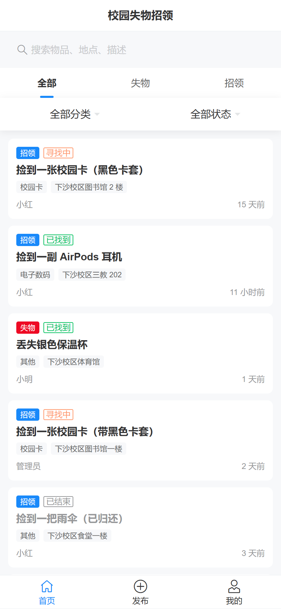 |  | 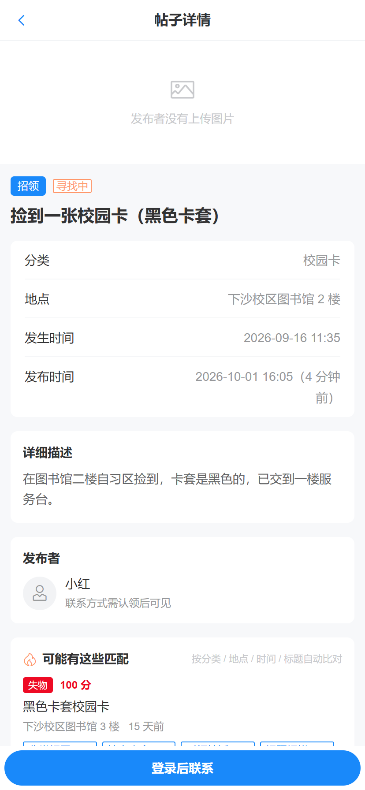 |

### 发布与编辑

| 发布表单 | 图片上传 | 发布成功 |
| --- | --- | --- |
| 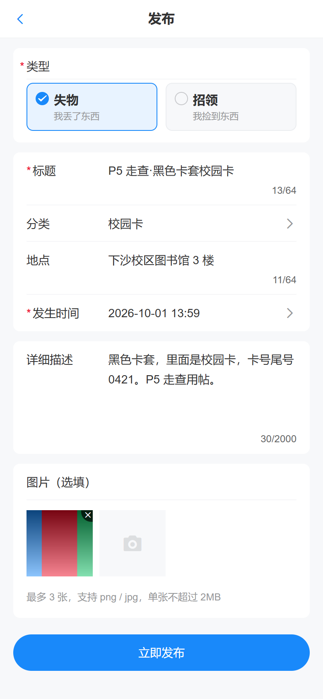 | 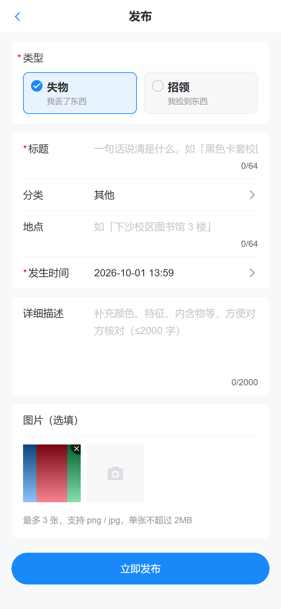 | 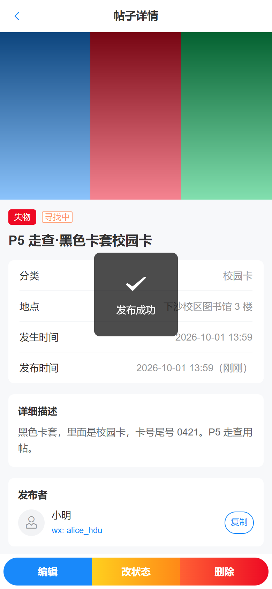 |

### 认领链路（帖主 / 申请人双视角）

| 提交认领证明 | 帖主审核台 | 生成凭证码 |
| --- | --- | --- |
| 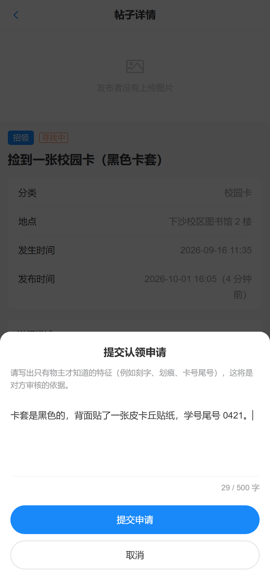 | 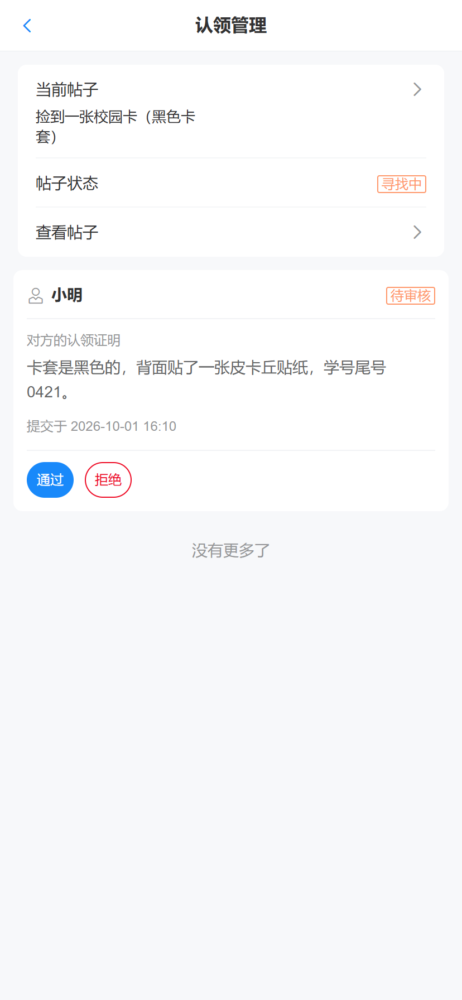 | 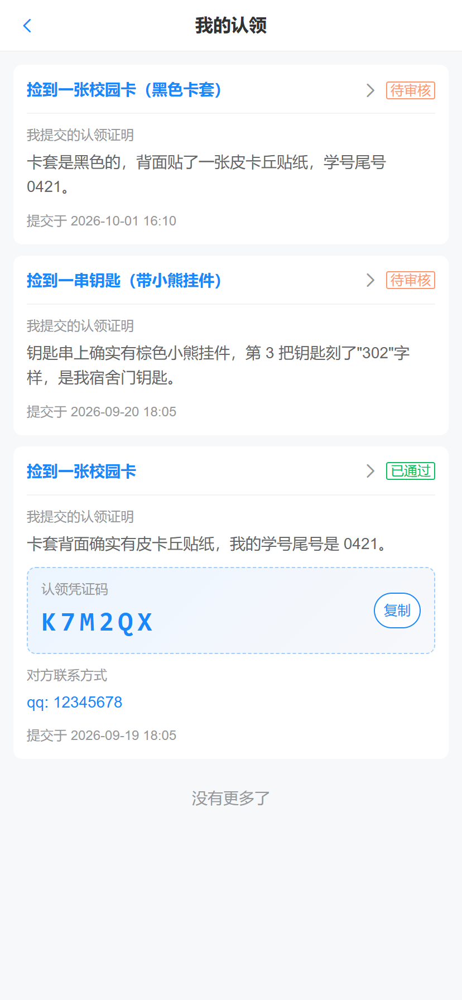 |

| 联系方式解锁 | 核销凭证 | 拾金不昧证书 |
| --- | --- | --- |
| 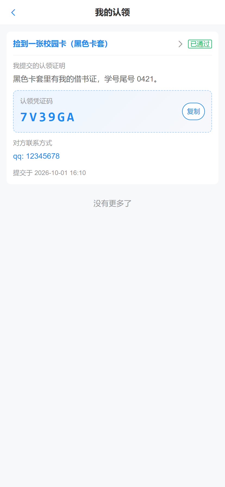 | 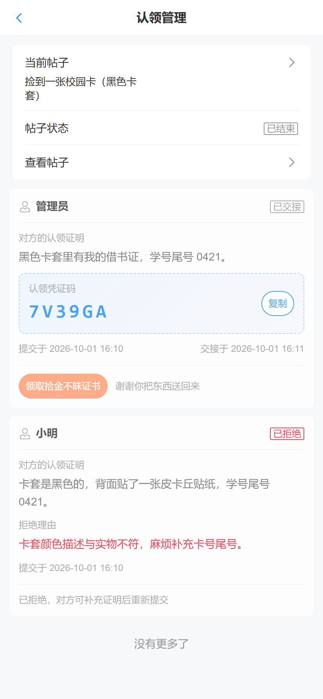 | 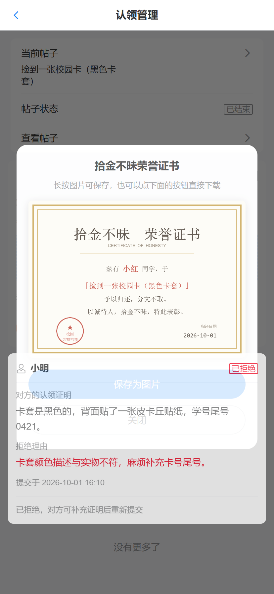 |

### 智能匹配与状态流转

| 匹配推荐 | 状态流转弹层 | 个人中心 |
| --- | --- | --- |
|  | 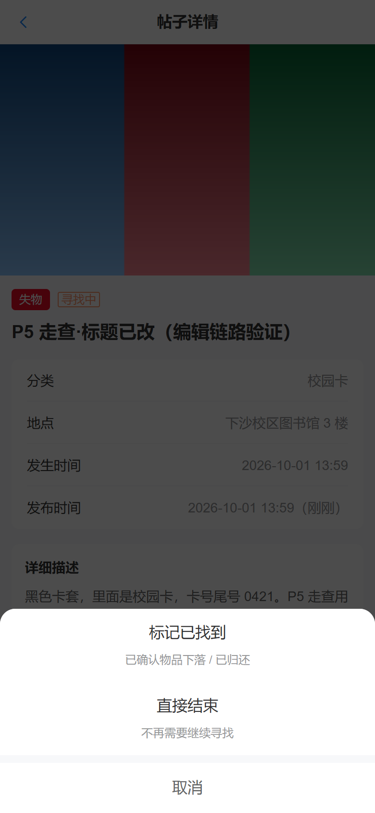 |  |

> 完整走查截图：`docs/screenshots/p5/`（56 张）、`docs/screenshots/p6/`（30 张）。

---

## 快速开始

### 1. 数据库

```bash
cd server
# 方式 A：Docker（推荐）
docker compose up -d
docker compose exec -T mysql mysql -uroot -plostfound123 < sql/schema.sql

# 方式 B：本机 MySQL 8
mysql -uroot -p < sql/schema.sql
```

### 1.5 演示数据

```bash
cd server
# 3 个账号（alice / bob / carol，密码统一 123456）+ 16 条帖子 + 2 条认领记录
# Windows 下必须显式指定字符集，否则中文昵称会按 GBK 解码报错
mysql --default-character-set=utf8mb4 -uroot -p < sql/seed.sql

# 或直接：
make seed
```

### 2. 后端

```bash
cd server
cp .env.example .env      # 按实际情况修改 DB_PASSWORD / JWT_SECRET
go mod tidy
go run ./cmd/api
# → http://localhost:8080/api/health
```

### 3. 前端

```bash
cd web
npm install
npm run dev
# → http://localhost:5173
```

---

## 测试账号

seed 数据内置 3 个账号，密码统一为 `123456`：

| 用户名 | 昵称 | 角色 | 联系方式 | 说明 |
| --- | --- | --- | --- | --- |
| `alice` | 小明 | `user` | `wx: alice_hdu`（**公开**） | 演示「作者主动公开联系方式」 |
| `bob` | 小红 | `user` | `qq: 12345678`（默认不公开） | 演示「需认领通过后可见」 |
| `carol` | 管理员 | `admin` | `tel: 13800000000` | 演示「admin 也读不到别人的认领列表」 |

> **`carol` 虽然是 admin，但 `GET /api/posts/:id/claims` 依然会返回 1003**
> —— 这是刻意的设计：审核允许 admin（处置事故），读取不允许（窥探纠纷细节）。

---

## 目录结构

```
kanzakierisa/
├── README.md                     本文件
├── docs/
│   ├── api.md                    19 个接口的完整契约
│   ├── code-guide.md             技术说明（概览/目录/数据库/关键实现/安全/限制）
│   ├── wireframe/                页面线框
│   └── screenshots/
│       ├── p5/                   发布编辑与个人中心走查（56 张）
│       └── p6/                   认领链路走查（30 张）
├── server/                       后端（Go 1.22+ / Gin / MySQL）
│   ├── cmd/api/main.go           入口
│   ├── internal/
│   │   ├── config/               配置加载与 DSN
│   │   ├── db/                   连接池
│   │   ├── router/               路由注册与依赖装配
│   │   ├── middleware/           RequestID / Recover / CORS / Auth / OptionalAuth
│   │   ├── handler/              HTTP 编解码层（零 SQL）
│   │   ├── service/              业务规则层
│   │   ├── store/                手写参数化 SQL 层（零 HTTP）
│   │   ├── model/                实体与 DTO
│   │   └── pkg/                  无状态工具包（apperr/jwtutil/voucher/similar/...）
│   ├── sql/
│   │   ├── schema.sql            建表（含 approved_flag 生成列）
│   │   └── seed.sql              演示数据
│   ├── Makefile
│   ├── docker-compose.yml
│   └── .env.example
└── web/                          前端（Vue 3 / Vite / Vant）
    └── src/
        ├── api/                  6 个接口封装模块
        ├── components/           8 个可复用组件
        ├── pages/                8 个页面
        ├── router/               路由 + 登录守卫
        ├── store/                Pinia 用户状态
        ├── constants/            枚举与常量
        └── utils/                时间与文案格式化
```

完整的逐目录说明见 [`docs/code-guide.md` 第二章](docs/code-guide.md)。

---

## 技术栈

| 层  | 选型 |
| --- | --- |
| 后端 | Go 1.22+（实测 1.27.1）· Gin · database/sql + sqlx（**手写参数化 SQL，不用 ORM**） |
| 数据库 | MySQL 8.0（实测 8.0.46） |
| 认证 | JWT（HS256）· bcrypt（cost=10） |
| 前端 | Vue 3（`<script setup>`）· Vite · Vant 4 · Pinia · Vue Router · Axios |

---

## 文档

| 文件 | 内容 |
| --- | --- |
| [`docs/api.md`](docs/api.md) | 19 个接口的完整契约：鉴权 / 请求体 / 请求示例 / 响应示例 / 错误表，以及跨接口的可见性、软鉴权、分页约定 |
| [`docs/code-guide.md`](docs/code-guide.md) | 项目概览与请求流转、目录说明、数据库设计、关键实现（按 SPEC 7.1–7.7 逐节）、安全措施清单、已知限制 |
| [`docs/wireframe/`](docs/wireframe) | 页面线框 |
| `docs/screenshots/p5/`、`docs/screenshots/p6/` | 浏览器走查截图（发布编辑 56 张、认领链路 30 张） |

---

## 设计思考

### 一、整体思路

这个系统的**核心难点不在 CRUD**，而在「认领」这一条链路上：

```
多个人可能认领同一样东西  →  并发下的业务不变量如何保证？
认领通过后联系方式要解锁  →  隐私数据如何只在该给的时候给？
帖子状态会被两条路径改动  →  规则如何只维护一份？
凭证码要被人念、被人抄    →  错误率如何降下来？
```

我给自己定的原则是：**能用数据库约束表达的规则，就不写在应用层。**

具体展开三处：

### 二、三处我认为最有价值的设计

#### 1. 「一张帖最多一条已通过认领」交给 MySQL 生成列 + 唯一索引

直觉写法是「先查有没有 `approved`，没有就插入」。这在并发下必然失效 ——
两个请求同时查到「没有」，然后双双插入。而认领恰恰是「几个同学同时抢一样东西」
的场景，天然高并发。

MySQL 8 没有「部分索引」，但可以用**生成列**绕出来：

```sql
approved_flag TINYINT GENERATED ALWAYS AS (
  IF(status IN ('approved','redeemed'), 1, NULL)
) STORED,
UNIQUE KEY uk_post_approved (post_id, approved_flag)
```

利用的就是「**MySQL 唯一索引允许任意多个 NULL**」这个特性：
`pending` / `rejected` 的 `approved_flag` 是 `NULL`，可以任意多条共存；
而 `approved` / `redeemed` 是 `1`，同一帖只能有一条。

两个细节值得一提：`redeemed` 也计入 `1`（否则核销后腾出空位，别人还能再通过一条）；
用 `STORED` 而非 `VIRTUAL`，因为可以直接 `SELECT approved_flag` 肉眼验证规则。

**收益**：这条约束连「有人绕过应用层直接写库」都挡得住。业务不变量变成了数据库事实。

#### 2. 联系方式可见性下推到 SQL，而不是「查出来再删」

SPEC 明确要求在 SQL 层决定是否 SELECT `contact`。我按这个做了，并且发现它的好处比想象中大：

```sql
CASE
  WHEN ? = p.user_id            THEN u.contact   -- 本人
  WHEN u.contact_public = 1     THEN u.contact   -- 作者公开
  WHEN EXISTS (SELECT 1 FROM claims c
               WHERE c.post_id = p.id AND c.claimant_id = ?
                 AND c.status IN ('approved','redeemed'))
                                THEN u.contact   -- 已通过的认领关系
  ELSE ''
END AS author_contact
```

两个收益：

1. **隐私数据不进内存**：不可见时数据库直接返回空串。而「查出来再删」的数据
   已经进过 Go 的内存 —— 可能进日志、可能进 panic 栈、可能被将来的某次重构漏删。
2. **不可能自相矛盾**：`contact` 和 `contact_visible` 出自**同一条 SQL 语句**，
   所以永远不会出现「标志说可见、值却是空字符串」这种响应。

列表接口更进一步，干脆不 SELECT 这一列 —— 列表页从不展示联系方式，
多查一列只是白白把全站用户的联系方式搬进内存。

#### 3. 状态机白名单只定义一次，并导出给认领流程复用

帖子状态会被两条路径改动：作者手动点按钮、认领审核时自动联动。
我在 P3 就把白名单函数 `ValidateTransition` **首字母大写导出**，
到 P6 认领流程直接复用。

如果 P6 图省事在 `claim_service` 里再写一份规则表，两份定义迟早分叉 ——
那正是状态机最典型的失效方式：**手动流转拦得住的非法跳转，自动流转却放过去了**。

更进一步：认领通过时的帖子状态更新，我给它加了一个 `tx` 参数
（原设计里没有），让认领写入和帖子状态更新在**同一个事务**里。
否则会出现真实的一致性洞：认领已 `approved`、帖子还停在 `open`，
用户看到「已通过但还在寻找中」。

### 三、借鉴点

| 借鉴来源 | 借了什么 | 怎么用的 |
| --- | --- | --- |
| 部分的索引思想 | 「部分唯一约束」 | MySQL 8 没有部分索引，用**生成列 + 唯一索引**实现等价效果（见上） |
| 数据库约束优于应用检查 | 让 DB 做最终裁决 | 重名、重复认领、多认领通过，全部靠唯一索引 + errno 1062，不用「先查再插」 |
| 白名单优于黑名单 | 枚举校验 | 类型 / 状态 / 分类全部白名单；状态流转也是白名单 map，而非 if-else 排除 |
| 纵深防御 | 不靠单一防线 | 上传三重校验（体积 + 扩展名 + 魔数）；密码「统一文案 + 时序拉平」双防护 |
| 恒定时间比较 | 防时序侧信道 | 凭证码用 `subtle.ConstantTimeCompare`，且先比长度再比内容 |

### 四、我踩过并记录下来的坑

只列三个最有代表性的，完整的在 `docs/code-guide.md`：

#### 1. 时间「差 8 小时」的经典 bug

`schema.sql` 里 `DEFAULT CURRENT_TIMESTAMP` 按**会话时区**求值，
而 Go 的 DSN 用 `loc=UTC` 解析 —— 一进一出凭空差 8 小时。

我的解法是「**时间只从一处产生**」：库里存 UTC（导入前先 `SET time_zone='+00:00'`）、
DSN 固定 `loc=UTC`、`updated_at` 由 Go 侧算好传进去（不用 SQL 的 `NOW()`）、
输出层手动 `Format(time.RFC3339)`，不依赖 json 包的默认序列化。

#### 2. CORS 拦掉「同源的写请求」——一个看起来像断网的 bug

原本 CORS 白名单只有 `localhost:5173`。表现极其反直觉：
手机连同一 Wi-Fi 打开 `http://<电脑IP>:5173`，**列表能加载，一登录就失败**。

原因在 Fetch 规范：**浏览器对同源的非 GET 请求同样会带 `Origin` 头**（GET 不带）。
前端是经 Vite proxy 转发 `/api` 的，所以从浏览器看是同源请求，
从服务端看却是一个带 `Origin` 的跨域 POST。

**复盘**：这个缺陷能藏到后期才暴露，是因为之前的验收全在 `localhost:5173`
这一个 Origin 上做的。**验收环境的多样性本身就是用例** ——
只在一个「恰好落在白名单里」的地址上跑，等于把这条规则测没了。

修法是改用 `AllowOriginFunc` 按来源判定（回环 + 私有网段，端口不限），
而不是维护固定白名单。

#### 3. `COUNT(*)` 与 `SELECT` 必须复用同一个 WHERE 构造器

如果 `total` 和 `list` 各拼一套筛选条件，就会出现「翻到第 3 页突然空了、
但 `total` 还显示有 200 条」。这是列表接口最经典、也最难通过单个接口测试
发现的 bug —— 因为第 1 页看起来完全正常。

我把条件构造收成一个纯函数 `buildPostWhere`，`List` 和 `Count` 共用，
这类不一致在结构上就不可能发生。

### 五、如果继续做，我会改进什么

| 优先级 | 项 | 思路 |
| --- | --- | --- |
| 高 | 图片孤儿文件回收 | 定期扫描 `uploads/`，清掉超过 N 小时未被 `posts.images` 引用的文件 |
| 高 | 自动化测试 | 先补 `pkg/*` 纯函数单测，再补 service 层的状态机与认领校验顺序 |
| 中 | 登录限流 | 网关层按 IP + 用户名做滑动窗口，失败达阈值后指数退避 |
| 中 | 深分页优化 | 改游标分页（`WHERE (created_at, id) < (?, ?)`），复用现有排序键 |
| 低 | 匹配语义化 | 引入句向量模型做语义召回，现有 `reasons` 机制直接保留作精排 |
| 低 | 服务端登出黑名单 | 用 Redis 存 jti 并设 TTL，或改短期 access + refresh token |

### 六、我对自己这份实现的判断

**做得比较满意的**：认领链路的并发安全（四层防护叠加）、
联系方式可见性的 SQL 下推、错误码语义的一致性（13 个码各有明确边界与固定校验顺序）。

**明确知道不足的**：没有自动化测试；匹配是字面相似度而非语义；
图片只增不删；分页是 offset 方案。

**一条贯穿始终的方法**：把「规则」和「执行点」分离 ——
规则只定义一次（状态机白名单、枚举白名单、可见性 CASE），
所有需要它的地方都复用同一份。这样即使将来加功能，也不会出现
「这个入口拦得住、那个入口放过去了」的不一致。

---

## 明确不做

- 校园统一身份认证对接
- 线上支付 / 酬谢金
- 站内私信 IM
- 拾主主动认领 `lost` 帖（本期只做「失主认领 `found` 帖」单向）
- 服务端 token 黑名单（登出仅前端清 token）
- 对象存储（图片存本地 `uploads/`）
- 自动化测试用例（以真实 curl + 浏览器走查留存证据代替）
