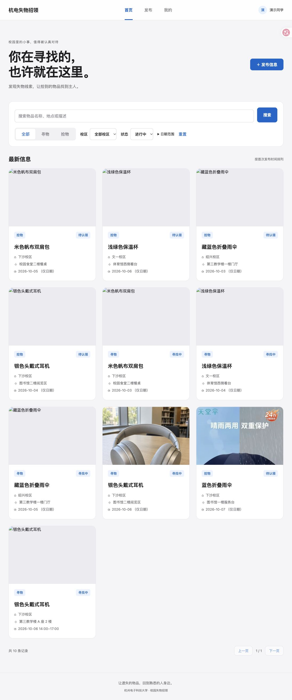
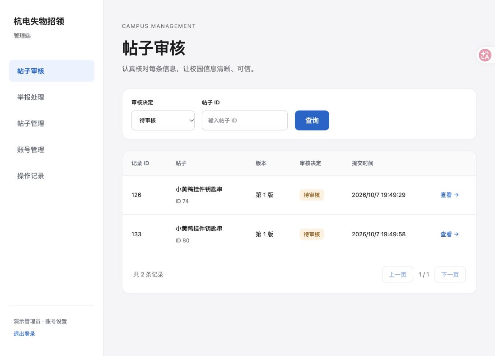
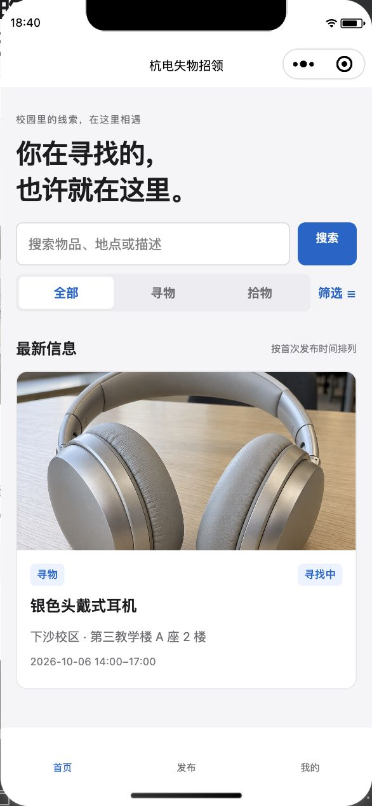

# 杭电校园失物招领

面向校园师生的失物招领项目，包含 **微信小程序、用户网页和管理网页**。三端连接同一 Go 后端，用户发布寻物或拾物信息，管理员审核后展示；联系与物品交接在线下完成。

本项目为 2026 杭助技术部招新小任务提交作品，GitHub 用户名：`loseheart-dev`。

## 功能

| 端 | 功能 |
| --- | --- |
| 用户网页 | 账号登录、搜索与校区/日期筛选、带图详情、发布与编辑、完成及恢复、撤回、举报、通知、审核历史、账号设置 |
| 微信小程序 | 用户端业务流程、原生选图与预览、微信绑定/换绑及快捷登录入口 |
| 管理网页 | 帖子审核、退回和拒绝、帖子下架、举报证据对照和处置、账号查询/禁用/重置密码、操作日志 |

每日最多发布 3 条新帖，额度跨端共用；编辑后重新审核且不占新帖额度。历史快照只读。所有帖子和图片都要求登录并检查访问权限，不提供公开匿名浏览、自助注册或私聊。

## 实际运行截图







图片、联系人和帖子描述为本地演示素材。演示批次包含寻物 6 条、拾物 6 条和 14 条审核记录，其中包含退回后补充重审；[批次清单](frontend/evidence/seeded-posts-20261007.json)保存记录 ID 与随机演示联系方式。数据库和私有 OSS 对象没有随代码打包，新环境不会自动出现本机业务记录。

## 技术与目录

- 后端：Go 1.27.1、Gin、GORM、MySQL 8.4、Redis 7.4；图片使用私有阿里云 OSS。
- 网页：Vue 3、Vite 7、原生 CSS；开发验证使用 Node.js 24。
- 小程序：原生 JavaScript、WXML、WXSS；微信开发者工具模拟器。
- 认证：Argon2id 密码哈希、HS256 JWT、24 小时有效期及登录版本撤销；网页使用 HttpOnly Cookie 和 CSRF，小程序使用 Bearer。
- 写操作：创建幂等键、资源版本条件、数据库事务，防止重复投稿和覆盖并发修改。

```text
backend/       Go 服务、配置范本与独立测试目录
frontend/      用户网页、管理网页、共享校验、运行截图与演示素材
miniprogram/   原生微信小程序
db/            建表 SQL
deploy/        MySQL / Redis 本地容器配置
docs/          API、数据库、模型、路由与登录设计
design/        三端设计图和接口对齐记录
PRD.md         产品需求与业务规则
```

## 本地启动

需要 Go 1.27.1、Node.js 22.12+（或 20.19+）、Docker Compose，以及微信开发者工具。以下命令在本项目根目录执行；在提交仓库中先进入 `loseheart-dev/`。

### 1. 数据库与私有配置

```sh
cp deploy/.env.example deploy/.env
cp backend/configs/config.example.yaml backend/configs/config.local.yaml
```

填写 `deploy/.env` 中的 MySQL、Redis 随机密码，再将对应连接参数写入 `config.local.yaml`。配置 JWT 签名与 CSRF 密钥、OSS Bucket 和凭证；需要微信登录/绑定时填写对应 AppID 与 AppSecret，并同步小程序 `project.config.json` 的 AppID。

```sh
docker compose -f deploy/compose.yaml up -d --wait --wait-timeout 180
docker exec -i lost-found-mysql sh -c 'MYSQL_PWD="$MYSQL_PASSWORD" exec mysql --protocol=TCP -h 127.0.0.1 -u lost_found -D lost_found' < db/schema.sql
```

建表命令只用于空数据库。账号由平台预置；普通用户须为已验证身份，管理端须使用管理员账号。新环境需预置自己的演示账号与 Argon2id 密码哈希；项目没有自助注册接口。本机账号密码仅保存在被 Git 忽略的私有文件中，不随仓库提供。

### 2. 启动后端与网页

在两个终端分别执行：

```sh
cd backend
go run ./cmd/server
```

```sh
cd frontend
npm ci
npm run dev
```

| 服务 | 地址 |
| --- | --- |
| 后端 API | `http://127.0.0.1:8080/api/v1` |
| 用户网页 | `http://127.0.0.1:5173/` |
| 管理网页 | `http://localhost:5173/admin` |

两个网页主机名用于隔离 Cookie，方便同时演示普通用户和管理员。同一主机名内的登录会共享。Vite 将 `/api` 请求代理到后端。

### 3. 打开微信小程序

在微信开发者工具中导入 `miniprogram/`，使用与后端一致的 AppID。模拟器 API 地址为 `http://127.0.0.1:8080/api/v1`，可使用账号密码登录。

项目关闭请求域名校验只用于本地模拟器。真机和上线需配置合法 HTTPS 服务域名、更新 API 地址及网页安全 Cookie 配置。开发者工具 CLI 服务不是普通运行的必需条件。

## 验证与演示

```sh
cd backend
go test -race ./...
go vet ./...
go build ./...
# 本地 MySQL / Redis 与配置齐备时执行真实数据库回归
LOST_FOUND_INTEGRATION=1 go test -race ./... -count=1
```

```sh
cd frontend
npm test
npm run build
```

共享字段校验的源文件为 `frontend/src/domain.js`，修改后在 `frontend/` 执行 `node scripts/sync-domain.js`，同步小程序版本。

演示顺序：发布带图帖子 → 管理端审核 → 用户端搜索查看 → 通知已读 → 本人标记完成/恢复 → 编辑重审 → 查看历史快照。举报处理、账号处置和日志在管理端独立展示。

本地已完成主要发布、审核、上传、通知及跨端会话流程验证，前端测试和生产构建通过；后端提供隔离账号集成测试。[完整验证记录](frontend/VERIFICATION.md)说明实际检查及边界。GitHub 提交仓库的 Actions 只检查目录结构，不能替代业务回归。

尚未完成真机、生产部署和上线审核验证；网页文件选择自动化受浏览器扩展权限限制，未将其声明为完整上传端到端验证。账号处置及微信换绑的隔离测试使用模拟微信上游，不等于真实微信平台验证。

## 文档

- [产品需求](PRD.md)
- [API 契约：37 个接口](docs/api-design.md)
- [数据库设计](docs/database-design.md)与[建表 SQL](db/schema.sql)
- [登录与认证](docs/login-design.md)
- [三端设计图 v2](design/apple-style-v2/README.md)
- [后端测试说明](backend/tests/README.md)
- [网页与模拟器演示说明](frontend/README.md)
- [本地容器说明](deploy/README.md)

本地配置、数据库密码、JWT/CSRF 密钥、OSS/微信凭证、演示账号密码及小程序个人配置均通过 `.gitignore` 排除。不要将这些私有文件加入公开提交。
