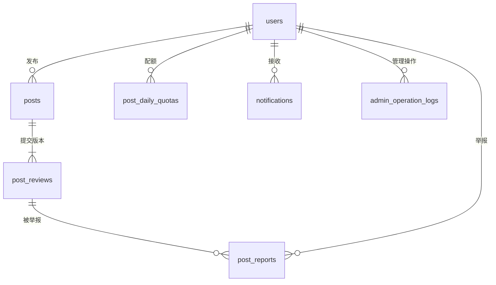

# 校园失物招领数据库设计

版本：v1.1，已确认表设计  
日期：2026-10-04  
依据：[PRD v2.5](../PRD.md)  
建表文件：[schema.sql](../db/schema.sql)

本稿采用 7 张 MySQL 表，覆盖账号、帖子、人工审核、举报、图片、系统通知；登录版本保存在用户表。登录限制改由 Redis 保存，不建立对应 MySQL 表。没有私聊表、物品分类表或 AI 审核表。SQL 以 MySQL 8.4 / InnoDB 为设计目标，尚未执行，也未创建数据库或容器。

## 1. 表清单与关联

| 表名 | 中文名称 | 保存什么 | 为什么单独保存 |
| --- | --- | --- | --- |
| `users` | 用户 | 模拟学号/职工号、密码哈希、身份、角色、微信绑定 | 两端共享同一平台用户，管理员也使用此表 |
| `posts` | 帖子 | 最新内容、图片数组、联系方式、审核状态、归还状态 | 首页、详情页和“我的发布”的主要数据来源 |
| `post_reviews` | 提交与审核记录 | 每次提交的内容快照、审核结果、管理员和原因 | 用户修改帖子后，原审核依据仍可追溯 |
| `post_daily_quotas` | 每日发帖额度 | 用户、北京时间日期、已成功提交数量 | 防止重复请求和并发请求突破每日 3 帖 |
| `post_reports` | 举报 | 举报人、被举报版本、理由、处理结果 | 举报依据不随帖子修改而变化 |
| `notifications` | 系统通知 | 审核/举报等结果及已读时间 | 支持“我的”中的消息提示，不提供私聊 |
| `admin_operation_logs` | 管理员操作日志 | 操作者、目标、动作、原因、前后状态 | 记录审核、下架、禁用、重置密码等管理操作 |



图中省略了审核人、处理人和通知关联帖子的辅助关系；完整外键见 SQL。Redis 登录限制按账号/IP 摘要保存，未知账号也要限制，不关联用户外键。

## 2. 用户与登录

### `users` 用户表

| 字段 | 类型 | 含义与约束 |
| --- | --- | --- |
| `id` | BIGINT UNSIGNED | 平台用户主键，两端使用同一个 ID |
| `account_no` | VARCHAR(32)，唯一 | 模拟学号/职工号；按字符串保存，保留前导零 |
| `identity_type` | ENUM | `student` 学生 / `staff` 教职工 |
| `nickname` / `avatar_url` | VARCHAR(50/512) | 展示名称、可空头像地址 |
| `password_hash` | VARCHAR(255) | Argon2id PHC 字符串，已包含参数、随机盐和哈希 |
| `token_version` | BIGINT UNSIGNED，默认 1 | 当前登录版本；退出、密码修改/重置、禁用及微信换绑成功时递增 |
| `must_change_password` | BOOLEAN | 管理员重置后要求先修改密码 |
| `role` | ENUM | `user` / `admin` |
| `status` | ENUM | `active` / `disabled` |
| `is_verified` | BOOLEAN | 演示账号的模拟校园身份是否已验证 |
| `wechat_appid` / `wechat_openid` | VARCHAR(32/128)，可空 | 绑定的小程序身份，组合唯一 |
| `wechat_bound_at` | DATETIME(3)，可空 | 微信绑定时间 |
| `password_changed_at` | DATETIME(3) | 最近密码设置/修改时间 |
| `created_at` / `updated_at` | DATETIME(3) | 创建、更新时间 |

不保存明文密码，不额外建立盐字段。预置账号也要生成真实密码哈希。学号、OpenID 等按区分大小写的字符规则比较；账号的输入规范化规则由后端统一执行。

微信绑定采用“一平台账号绑定一个小程序微信身份”的简单设计。先通过账号密码验证平台身份，再绑定后端验证得到的 OpenID；不能信任客户端直接提交的 OpenID。MVP 支持换绑：先验证平台密码，新身份绑定成功后旧绑定失效，失败则保留旧绑定；不提供单独解绑入口。AppID 是运行配置，不写死在表约束中；不保存 AppSecret、微信 session_key 或微信 Token。

### JWT + 用户表登录版本（已确认）

不建立独立登录会话表，也不在 Redis 保存登录会话。用户表增加 `token_version`，从 1 开始，只递增不重置。JWT 中包含用户 ID、签发/到期时间、登录版本、签发方和受众；有效期仍为 24 小时，不保存完整 JWT。

| 操作 | 处理方式 |
| --- | --- |
| 登录 | 验证密码或微信身份，读取当前版本写入 JWT；登录本身不增加版本 |
| 认证请求 | 验证签名、算法、时间、签发方和受众，然后实时读取用户版本、启用状态、校园验证、强制改密及角色；版本缺失/不一致拒绝 |
| 退出 | 按用户 ID 与当前 JWT 版本条件递增，成功后清除客户端凭证 |
| 修改/重置密码 | 同一事务内更新密码哈希、强制改密标志等字段并递增版本 |
| 禁用账号 | 同一事务内禁用用户并递增版本，使恢复启用也不会复活旧 JWT |

任何一端退出，都会使该账号网页、小程序及管理员端的所有旧 JWT 失效；不支持只撤销一台设备。新的请求需要重新登录。已经通过认证并在执行中的请求不会被自动中断，敏感写操作在事务内再次确认用户状态和版本。

退出条件更新示例（参数均由后端从已验证 JWT 得到）：

```sql
UPDATE users
SET token_version = token_version + 1
WHERE id = ? AND token_version = ? AND status = 'active';
```

旧令牌退出重试不能修改新版本；条件不匹配时按登录已失效处理。登录读取密码、状态和版本时，与改密、禁用、退出协调用户行锁；若为缩短锁时间提前计算密码哈希校验，锁定后必须再次确认密码哈希和版本未变。密码校验失败不能签发令牌。

此方案仍然每次认证查询 MySQL 用户表；不缓存旧版本。MySQL 查询失败时不能允许访问。网页 Cookie 的 CSRF 防护继续保留，不再依赖会话表中的摘要字段，机制已确认：同源代理、Origin/Referer 校验及 HMAC 双提交 CSRF，登录后绑定随机 JWT jti；jti 不落库，不用于单独撤销会话。

### Redis 登录限制（不建 MySQL 表）

| 建议 Key | 内容 | 到期规则 |
| --- | --- | --- |
| `lost-found:auth:fail:account:<hash>` | 账号连续失败计数 | 首次失败起 10 分钟，后续失败不刷新窗口 |
| `lost-found:auth:block:account:<hash>` | 账号暂停密码登录标记 | 第 5 次失败起 10 分钟，暂停期内尝试不延长 |
| `lost-found:auth:rate:ip:<hash>` | 来源请求计数 | 按来源限速窗口到期，登录及绑定相关请求每 IP 30 次/分钟 |

`hash` 为规范化账号或 IP 的 SHA-256；不存在的账号也使用同一限制流程。摘要仍按敏感运行数据保护，不视为不可识别的匿名数据。后端用 Lua 脚本原子完成计数、设置过期时间和达到阈值后的暂停标记，避免并发丢计数或产生永不过期的 Key。成功密码登录重置对应账号失败计数，不清空来源限速。

这类临时记录按 TTL 过期，帖子等业务记录仍永久保留。Redis 不可用时暂拒绝新登录、已签发 JWT 继续按 MySQL 用户版本和状态验证，已确认；密码校验型换绑也返回 503。Redis 重启后的限制恢复取决于持久化配置，不能默认保证计数不丢失。

参考：[Redis 计数与限速示例](https://redis.io/docs/latest/commands/incr/)、[过期时间](https://redis.io/docs/latest/commands/expire/)。

## 3. 帖子与图片

### `posts` 帖子表

| 字段 | 类型 | 含义与约束 |
| --- | --- | --- |
| `id` / `author_id` | BIGINT UNSIGNED | 帖子主键、发布者外键 |
| `post_type` | ENUM | `lost` 寻物 / `found` 招领，必选 |
| `item_name` | VARCHAR(50) | 物品名称，必填，不设分类 |
| `campus` | ENUM | `xiasha` 下沙 / `shaoxing` 绍兴 / `wenyi` 文一，必选 |
| `location` | VARCHAR(100) | 丢失/拾获地点，必填 |
| `event_date` | DATE | 丢失/拾获日期，必填，按北京时间理解 |
| `time_precision` | ENUM | `date` 仅日期 / `exact` 具体时间 / `range` 时间段 |
| `event_time_start` / `event_time_end` | TIME，可空 | 具体时间只填开始值；时间段使用同日开始与结束值 |
| `description` | VARCHAR(300) | 必填描述；补充信息也计入 300 字 |
| `images` | JSON，默认 `[]` | 有序 OSS Object Key 数组，最多 6 张，第一张为封面 |
| `contact_methods` | JSON | 至少一种联系方式，结构见下 |
| `review_status` | ENUM | 审核/下架状态 |
| `resolution_status` | ENUM | 寻找/归还进度 |
| `revision` | INT UNSIGNED | 当前提交内容版本，从 1 开始 |
| `state_version` | INT UNSIGNED | 每次状态/内容变化加 1，防止并发覆盖 |
| `review_reason` / `reviewed_by` / `reviewed_at` | VARCHAR(500) / BIGINT / DATETIME | 最新审核或下架的原因、操作者和时间，可空 |
| `submitted_at` | DATETIME(3) | 当前版本提交时间，用于审核队列排序 |
| `first_published_at` | DATETIME(3)，可空 | 首次通过审核时间 |
| `completed_at` / `withdrawn_at` | DATETIME(3)，可空 | 完成、撤回时间 |
| `creation_key` | CHAR(36) | 客户端为一次新帖请求生成的 UUID，与作者组合唯一 |
| `creation_payload_hash` | BINARY(32) | 原始创建参数摘要，识别同一请求键被用于不同内容 |
| `created_at` / `updated_at` | DATETIME(3) | 创建、更新时间 |

联系方式示例：

```json
[
  {"type": "wechat", "value": "example_wechat"},
  {"type": "phone", "value": "13800000000"}
]
```

`type` 支持 `wechat` / `phone` / `qq` / `other`。数据库验证非空数组及结构，后端进一步校验去空白后非空、号码格式等。每项值最多 200 字符。首页列表接口不返回联系方式，已认证且有权查看详情时才返回。

| 审核状态 | 含义 |
| --- | --- |
| `pending` | 待人工审核，对其他用户不可见 |
| `approved` | 审核通过，可按归还状态展示 |
| `returned` | 退回修改，对其他用户不可见 |
| `rejected` | 拒绝发布，对其他用户不可见 |
| `removed` | 管理员下架，对其他用户不可见 |

| 归还状态 | 寻物帖展示 | 招领帖展示 |
| --- | --- | --- |
| `active` | 寻找中 | 待认领 |
| `completed` | 已找回 | 已归还 |
| `withdrawn` | 已撤回 | 已撤回 |

两类状态独立。例如已归还帖子仍保留“审核通过”的记录；管理员下架不应抹掉已归还时间。对其他用户可见条件为审核通过、未撤回且发布者处于启用/已验证状态；首页默认只展示 `active`。作者与管理员的查看权限另行判断。

修改公开内容、联系方式或图片后：版本加 1、状态改为待审核、清空当前审核结果，并立即隐藏。标记完成、撤回不增加内容版本，但增加 `state_version`。撤销完成将状态改回 `active` 并清空 `completed_at`。审核操作必须核对当前版本，不能批准已被替换或撤回的提交。

数据库检查同日时间段、字段长度等静态规则；“事件时间不能在未来”需要后端按北京时间验证。若不能确定时间可只填日期；跨日情况首版使用日期与描述表达。

### 帖子内图片数组（已确认）

不建立独立图片表，当前图片保存在 `posts.images` 中，完整数组也复制到该次提交的审核快照。字段默认 `[]`，没有图片时不使用 NULL。示例：

```json
[
  "posts/users/1001/random-a.jpg",
  "posts/users/1001/random-b.png"
]
```

- 保存私有 OSS 的 Object Key，不保存公开 URL、临时签名 URL、图片二进制或密钥。Bucket `go-lost-found` 由后端配置。
- 最多 6 项，不允许重复；每项为非空字符串，最长 512 字符。数据库使用 JSON Schema 约束数组结构；后端还要校验对象归属和存在性。
- 数组顺序即展示顺序，第一张为封面。数组增删或调整顺序都属于内容修改，需要重新审核。
- JPEG/PNG、单张最多 5,242,880 字节（5 MiB）的限制在后端上传流程执行，不能仅依赖客户端声明的扩展名或大小。
- 每次上传生成新的随机 Object Key，不覆盖旧对象。新版本继续使用旧图时复用 Key，不复制文件；历史版本图片数组保留在审核快照中。

上传后端根据已验证用户 ID 生成用户专属前缀，例如 `posts/users/<user_id>/<uuid>.jpg`，成功上传后返回 Object Key。提交帖子时仅接受该用户前缀下、已存在于指定 Bucket 的对象，校验 OSS 对象信息；后端不允许覆盖对象或把任意外部 URL 当作图片。前缀归属规则、对象存在性及上传校验由应用执行，数据库不保存独立上传记录。

读取接口以帖子 ID、当前图片下标定位数组元素，校验用户及帖子权限后代理读取 OSS；普通用户不能指定任意 Object Key 或读取审核历史。作者/管理员查看旧版本时，以有权访问的审核记录定位快照图片。接口返回平台图片访问地址，而不是 OSS 直链；图片请求同样验证 JWT 和用户登录版本。未提交图片预览仅允许上传者按用户前缀读取。

OSS 上传在数据库事务外完成，图片数组、审核快照和发帖额度在数据库事务内保存。上传失败不产生有效 Key；数据库提交失败不扣额度，已上传文件留在 OSS。演示阶段不自动删除未使用或历史图片，不提供独立上传记录管理。

## 4. 审核、举报、额度

### `post_reviews` 提交与审核记录表

| 字段 | 含义 |
| --- | --- |
| `id` / `post_id` / `revision` | 审核记录、帖子、版本；帖子与版本组合唯一 |
| `decision` | `pending` / `approved` / `returned` / `rejected` / `superseded` |
| `content_snapshot` | 后端生成的完整提交快照：物品、校区、地点、时间、描述、联系方式、图片 Object Key 数组（含顺序） |
| `reviewer_id` / `reason` | 审核人、原因 |
| `submitted_at` / `processed_at` | 提交、处理时间 |

每次首次提交或修改重提都创建记录，快照在事务提交后不可修改。图片对象标识仅供后台追溯，不直接暴露给用户。尚未审核的旧版本被新版本替换时设为 `superseded`，不产生管理员审核结果。通过/退回/拒绝仍由人工处理；审核完成后，帖子状态、记录、通知和管理员日志在同一事务中写入。

下架记录进入管理员操作日志，不改写原“通过”结论。不可变快照、审核人管理员权限和快照字段完整性由应用保证，JSON 对象约束本身无法保证这些规则。

### `post_daily_quotas` 每日额度表

字段为 `user_id`、`quota_date`、`submitted_count`、`updated_at`；用户与日期组成主键，计数最大为 3。`quota_date` 采用北京时间自然日，不需要每天清零。

新帖事务先锁定用户并确认身份，再检查同作者的 `creation_key`：已存在且原始参数一致则返回原帖；不一致则拒绝复用。随后建立/锁定当日额度，检查小于 3，创建含图片数组的帖子、审核快照并增加计数，一并提交。统一按用户→额度→帖子顺序取得锁，避免接口之间锁顺序不一致。

创建失败全部回滚；退回、拒绝、撤回不返还额度；修改和重提同帖不扣额度。创建参数摘要后续不随帖子修改更新。额度日期按后端受理该次新帖事务时计算，两端共用这个判断。

### `post_reports` 举报表

| 字段 | 含义 |
| --- | --- |
| `id` / `reporter_id` | 举报 ID、举报人 |
| `post_id` / `post_revision` | 被举报的帖子及提交版本，外键关联审核快照 |
| `reason_type` | 虚假信息 / 不良内容 / 隐私泄露 / 骚扰 / 其他 |
| `details` | 补充说明，最多 500 字；选“其他”必须填写 |
| `status` | `pending` 待处理 / `handled` 已处理 / `dismissed` 不成立 |
| `result_action` | `none` / `remove_post` / `disable_user`，待处理为 NULL |
| `handler_id` / `handling_reason` / `handled_at` | 管理员、处理原因、时间 |
| `created_at` | 举报时间 |

同一用户对同一帖子版本只能举报一次，重复请求返回原记录；不同人的举报分别保存，后台可按帖子聚合显示。不会因举报数量自动下架。管理员处理旧版本举报时须同时查看当前版本，明确是否对当前帖子下架或禁用作者；处理结果、状态变更、通知与日志一并提交。

## 5. 通知与管理日志

`notifications` 保存 `id`、`user_id`、`type`、`title`、`content`、可空的 `post_id/review_id/report_id`、`read_at`、`created_at`。类型覆盖审核、下架、举报结果、账号状态和密码重置。`read_at` 为空表示未读；通知不保存临时密码、Token 或完整联系方式。只允许收件人读取及标记已读。

`admin_operation_logs` 保存 `id`、`operator_id`、`action`、可空的 `target_user_id/target_post_id/target_report_id`、`reason`、`state_before`、`state_after`、`created_at`。目标至少填写一个；状态 JSON 仅记录状态、版本等必要信息，不复制密码哈希、Token 或联系方式。审核通过可以使用固定的“审核通过”说明，其余管理操作必须给出具体原因。

不引入通用业务事件系统；常规用户修改由提交快照追溯，管理行为由日志追溯。

## 6. 索引与实现边界

| 查询 | 设计 |
| --- | --- |
| 账号登录 / 微信绑定登录 | 学号唯一索引 / AppID + OpenID 唯一索引 |
| 首页最新帖子 | 审核状态 + 归还状态 + 首次发布时间 + ID 索引 |
| 校区与帖子类型筛选 | 校区 + 类型 + 状态 + 发布时间 + ID 索引 |
| 我的发布 | 作者 + 创建时间 + ID 索引 |
| 待审核 / 待处理举报 | 状态 + 提交/创建时间 + ID 索引 |
| 我的通知 | 收件人 + 已读时间 + 创建时间 + ID 索引 |
| 管理日志 | 时间索引、操作者 + 时间索引 |

关键词暂使用参数化 `LIKE` 搜索物品名、地点和描述，并转义用户输入的 `%`、`_`。<!-- ponytail: 小规模演示允许包含匹配扫描；实测搜索延迟成为问题时再评估全文索引。 --> 初稿不增加全文索引。首页默认按首次审核通过时间倒序，同时间按帖子 ID 倒序；重审通过不刷新首次发布时间。

所有系统时间以 UTC 保存，接口转换为北京时间；事件日期/时间及额度日期本身使用北京时间语义。ID 在 Go 中使用 `uint64`，JSON API 输出字符串避免前端大整数精度损失。每个数据库连接使用严格 SQL 模式和 UTC 设置，避免无效枚举或超长字段被静默转换。

外键采用默认限制删除，不设置级联删除，也不设置 `deleted_at`：撤回、下架、禁用以状态表达，业务数据持久保留。GORM 模型使用明确字段，不直接嵌入自带软删除字段的 `gorm.Model`；建表及后续结构变更使用明确 SQL，避免 `AutoMigrate` 意外改变设计。

权限、JWT 24 小时有效期和版本递增、图片实际类型、每日事务计数、审核并发、快照不可变及事件非未来等规则仍须 Go 后端实现；不能把建表成功等同于这些业务规则已经生效。

设计依据：[MySQL CHECK 约束](https://dev.mysql.com/doc/refman/8.4/en/create-table-check-constraints.html)、[JSON Schema 校验](https://dev.mysql.com/doc/refman/8.4/en/json-validation-functions.html)、[外键约束](https://dev.mysql.com/doc/refman/8.4/en/create-table-foreign-keys.html)、[事务锁定读](https://dev.mysql.com/doc/refman/8.0/en/innodb-locking-reads.html)。

## 7. 已确认的设计选择

以下六项已于 2026-10-03 确认：

1. **联系方式使用 JSON。** 保存在帖子 `contact_methods` 字段，不建立独立表；至少一种联系方式，MVP 不按联系方式搜索，不新增每类只能填一个的限制。
2. **微信一对一绑定。** 每个平台账号最多绑定一个微信身份，同一小程序的微信身份最多绑定一个平台账号。MVP 支持验证平台密码后换绑，失败保留旧绑定；不提供单独解绑入口。
3. **举报按用户和内容版本去重。** 同一用户对同一帖子版本只保留一次举报，重复请求返回原记录；修改后的新版本允许再次举报，不同人的举报分别保存。
4. **保留审核快照。** 每次提交保存完整文字、联系方式及有序图片 Object Key 数组，提交后不可修改；不重复上传图片文件，也不覆盖历史对象。
5. **首页按首次审核通过时间倒序。** 同时间按帖子 ID 倒序；重审通过不刷新首次发布时间。
6. **字段上限与 MySQL 版本。** 每项联系方式值最多 200 字符，举报说明、审核/举报处理原因及管理员日志原因最多 500 字符；MySQL 使用 8.4 系列，具体补丁版本与容器配置在实施时确定。

表结构仍为 7 张 MySQL 表；图片与联系方式保存在帖子 JSON 字段，JWT 使用用户表登录版本，登录限制使用 Redis，每日发帖额度使用 MySQL。

本稿已完成表间关系和 PRD 规则的结构核对；尚未在 MySQL 执行建表，也未验证运行时约束、并发事务或 OSS 读写。下一阶段形成数据库迁移、初始化数据和接口设计。来源限速、Redis 故障处理及 CSRF 机制已在 [接口文档 v1.0](api-design.md) 定稿；Redis 持久化与容器配置仍在部署阶段确定。

2026-10-04 补充：微信换绑成功在同一事务中递增登录版本，首次绑定及绑定同一身份不递增；已完成帖编辑后保留完成状态并重审，撤回后不可编辑/恢复；禁止举报自己的帖子。管理员禁用/重置仅针对普通用户；随机临时密码仅在本次授权重置响应中交付，不存明文。以上不需要增加表或字段，建表 SQL 保持不变。
