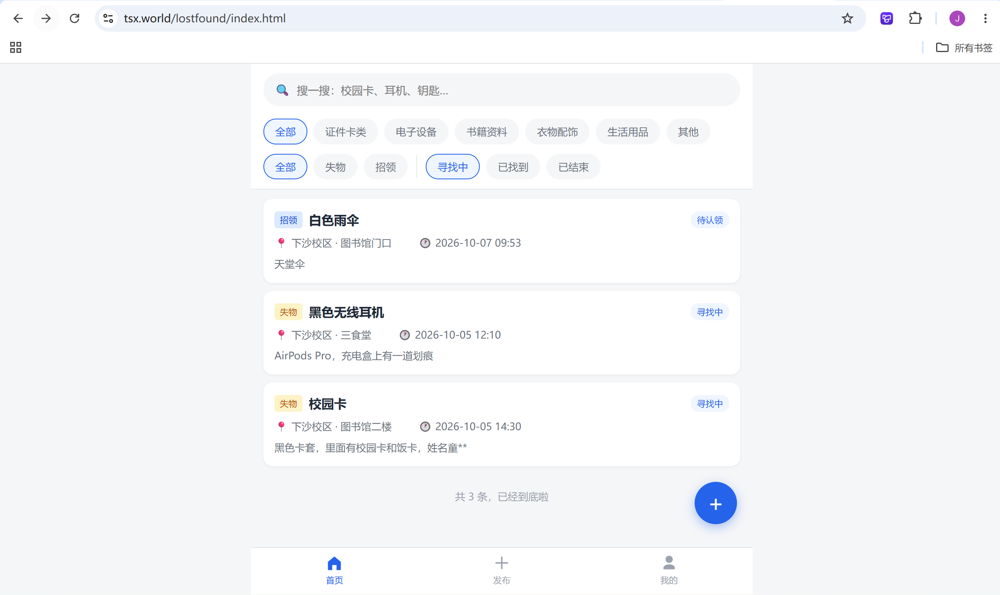

# 校园失物招领系统

> 一个面向校园场景的失物招领平台 —— 让丢东西的人和捡到东西的人在这里相遇。



## 🎬 演示视频

▶️ **在线观看**：通过网盘分享的文件：校园失物招领系统演示视频.mp4
链接: https://pan.baidu.com/s/1s6GJt1NQ3SUhjqj5ZMOJOw?pwd=rhw7 提取码: rhw7 
--来自百度网盘超级会员v2的分享

---

## 📖 项目简介

校园里丢东西是高频场景，但信息往往散落在各个 QQ 群、表白墙里 —— 找的人翻不到，捡到的人也没处说。

本项目提供一个集中的失物招领平台：

- **发帖**：丢东西发「失物」，捡到东西发「招领」
- **找帖**：关键词 + 分类 + 校区 + 状态多维度筛选
- **联系**：联系方式默认隐藏，**登录后**才能查看 —— 防止爬虫抓取和陌生人骚扰

## ✨ 功能一览

| 模块 | 功能 |
|---|---|
| 用户体系 | 注册 / 登录 / 获取当前用户 / 退出（JWT + bcrypt 密码加密） |
| 信息发布 | 失物 / 招领两类帖子，含分类、校区、地点、时间、描述 |
| 搜索筛选 | 关键词搜索（标题 / 描述 / 地点）+ 分类 + 类型 + 状态 + 分页 |
| 状态管理 | 寻找中 → 已找到 → 已结束，只前进不回退 |
| 联系方式 | 发布时填写、默认不可见，登录后经专门接口获取 |
| 个人管理 | 我的发布 / 编辑 / 删除 |

## 🛠 技术栈

| 层 | 技术 |
|---|---|
| 后端 | Go 1.27 · Gin v1.12 · GORM v1.31 |
| 数据库 | MySQL 8.4（utf8mb4） |
| 认证 | JWT（golang-jwt/v5）· bcrypt |
| 前端 | 原生 HTML / CSS / JavaScript |
| 部署 | Nginx 反代 + systemd 托管（详见 [`docs/代码导读.md`](docs/代码导读.md) 第十一章） |

## 🚀 快速开始

### 1. 准备数据库

```sql
CREATE DATABASE lostfound CHARACTER SET utf8mb4 COLLATE utf8mb4_unicode_ci;
```

### 2. 配置

```bash
cp config.example.yaml config.yaml
# 编辑 config.yaml，填入你的 MySQL 密码
```

### 3. 启动

```bash
go run .
# 或编译后运行：go build -o lostfound.exe . && ./lostfound.exe
```

看到 `🚀 服务已启动：http://localhost:8080` 即成功。**首次启动会自动建表**（GORM AutoMigrate），不需要手动执行 SQL。

### 4. 灌入演示数据（可选）

```bash
bash scripts/seed_data.sh    # 3 个演示账号 + 18 条帖子，可重复运行
```

### 5. 打开浏览器

访问 **http://localhost:8080** 即可使用完整应用（后端直接托管前端页面，无需另起前端服务）。

## 📡 API 接口

共 **12 个接口**（认证 4 + 物品 8），统一前缀 `/api`：

| 方法 | 路径 | 说明 | 需登录 |
|---|---|---|---|
| POST | `/api/auth/register` | 注册 | |
| POST | `/api/auth/login` | 登录 | |
| GET | `/api/auth/me` | 获取当前用户 | ✅ |
| POST | `/api/auth/logout` | 退出 | ✅ |
| GET | `/api/items` | 列表（搜索 / 筛选 / 分页） | |
| POST | `/api/items` | 发布 | ✅ |
| GET | `/api/items/my` | 我的发布 | ✅ |
| GET | `/api/items/:id` | 详情 | |
| GET | `/api/items/:id/contact` | 查看联系方式 | ✅ |
| PUT | `/api/items/:id` | 编辑（仅本人） | ✅ |
| PATCH | `/api/items/:id/status` | 改状态（仅本人） | ✅ |
| DELETE | `/api/items/:id` | 删除（仅本人） | ✅ |

完整参数说明见 [`docs/API接口文档.md`](docs/API接口文档.md)；可导入 Apifox 的定义见 [`docs/openapi.json`](docs/openapi.json)。

## 📂 项目结构

```
lostfound/
├── main.go            # 入口：读配置 → 连数据库 → 自动建表 → 启动服务
├── config/            # 配置加载（YAML → 结构体）
├── models/            # 数据模型（User / Item）
├── dao/               # 数据访问层（只和数据库打交道）
├── service/           # 业务逻辑层（校验、状态机）
├── controller/        # HTTP 处理层（解析请求 → 调 service → 返回响应）
├── middleware/        # JWT 认证中间件
├── router/            # 路由注册 + 前端静态托管
├── utils/             # JWT 签发与校验
├── web/               # 前端 6 个页面（原生 HTML / CSS / JS）
├── scripts/           # 冒烟测试（47 项断言）+ 演示种子数据
└── docs/              # 项目文档（见下）
```

## 🎯 设计亮点

**1. 联系方式在结构上不可能泄露**
`Item.Contact` 字段标记 `json:"-"` —— 序列化时永远不出现在列表 / 详情响应里，唯一出口是专门的 `GET /items/:id/contact`（挂登录中间件）。不是"记得过滤"，是"想泄露都泄露不了"。

**2. 状态与归属由后端强制**
`status` 和 `user_id` 不接受前端传值：状态只能通过专门接口按状态机流转，归属取 JWT 解出的当前用户 —— 从根上杜绝冒充发帖和状态回退。

**3. 状态机用一行挡住三种非法操作**
`寻找中 → 已找到 → 已结束` 只前进不回退。用 map 把状态映射成数字比大小，一个 `<=` 同时挡住回退、原地、跳级。

**4. JWT 无状态的取舍**
退出登录做成"服务端返回成功 + 前端删 token"，代码注释里说明了原因（JWT 无状态，服务端不留记录；要强制下线需引入黑名单，本项目按需取舍）。

## 📚 项目文档

| 文档 | 内容 |
|---|---|
| [`docs/代码导读.md`](docs/代码导读.md) | **零基础教学**（3600+ 行）：从"网页背后发生了什么"讲到部署上线，每一行代码都有解释 |
| [`docs/API接口文档.md`](docs/API接口文档.md) | 12 个接口的完整说明（参数 / 示例 / 错误码） |
| [`docs/openapi.json`](docs/openapi.json) | OpenAPI 定义，可直接导入 Apifox |
| [`docs/Apifox测试指南.md`](docs/Apifox测试指南.md) | 从安装 Apifox 到调通全部接口的完整流程 |

## 🌐 在线体验

已部署上线：**https://tsx.world/lostfound/**

